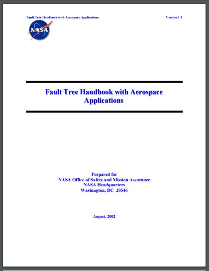

# Fault Tree Basics 

```{r setup_basics, include=FALSE}
knitr::opts_chunk$set(echo = TRUE, eval=TRUE)
library(FaultTree)
```

This second introductory essay assumes the user has installed R and the FaultTree package. If this is not the case please refer to ‘Getting started with FaultTree on R’. This essay will examine a simple example in *Section 5.1 (page 55)* in **‘Fault Tree Hand book with Aerospace Applications’** published by *NASA*. This document is available for free download at [http://www.hq.nasa.gov/office/codeq/doctree/fthb.pdf](http://www.hq.nasa.gov/office/codeq/doctree/fthb.pdf)

 

 
In this example we are encouraged to think of water flowing through two valves A and B. It could be more exciting to think of it as rocket fuel from Fuel Storage passing through pump A and valve B to a Rocket Engine.
 


In the first instance we want to consider that the undesired event is ‘no flow to the Receiver’. This tree will be named ‘nasa1’ and the first line of our FaultTree script can be entered into the console as:
 
```{r}
nasa1<-ftree.make(type="or", name="no flow to", name2="Receiver")
```
 
 
Notice that the character combination ‘<-' forming a sort of arrow is an assignment operator in R. An equals sign '=' would also work, but has not been used to distinguish it from argument assignment. This script line really hasn't done much yet, but a fault tree object has been created, named 'nasa1', as a dataframe in R. A dataframe can be viewed by just typing its name at the > prompt on the console:
 
 
```{r}
nasa1
```

 
This is output from FaultTree version 0.0.12 and may change somewhat as development progresses to a substantial completion for CRAN release. The top event was created as an OR gate (type=”or”) because it is known that there will be two possible causes for lack of flow to the Receiver. Those causal events will be “no flow in Line 2” or “Component B blocks flow”. The existence of either event will result in no flow to Receiver.
 
The dataframe has been generated with an ID of 1 to this top event by default. Negative-one (-1) values generally indicate no numeric value exists. The top gate has no parent node for either graphic display (GParent) nor calculation (CParent). The top event occupies Level 1 in the logical tree hierarchy. The OR gate type has been stored as a numeric value of 10. The name to be placed in the label box has been split to two lines using name and name2 arguments to the ftree.make function. Later fields of the dataframe will be discussed as progression is made to more complex models.
 
One might ask, ‘how can one know how to enter arguments in the ftree.make function?’. R has a help system and developer’s are required to maintain manual pages for all exported functions on most repositories – particularly CRAN. To view the manual page for this or any function just precede the name of the function with a question mark in the R console:
 
```{r}
?ftree.make
```

This will load the help page in the default browser. In the case of ftree.make it can be seen that there are more arguments than were defined in our script. Function arguments are often pre-loaded with useful default values. Defaulted arguments do not need to be added to a script command. In a typical windows application one would expect the argument options to be presented in a dialogue window after some menu selection. Well, R is different.
 
The next two script lines can be entered into the console as:

```{r}
nasa1<-addLogic(nasa1, at=1, type="or", name="no flow in", name2="Line 2")
nasa1<-addProbability(nasa1, at=1, prob=0.1, name="Component B", name2="blocks flow")

```

 
After this we can view select columns of the dataframe by entering:

```{r, eval=FALSE}
nasa1[,c(1:8,15,16)]
```

This will result in the following output:

A number of things can be reviewed here.
 
It can be observed that the addLogic function is very similar to the ftree.make function with the exception of a first argument that seemingly repeats the tree name and the ‘at’ argument. The first argument passes the tree dataframe object into the function so it can be modified. The output of the function will be the modified dataframe object. This is an example of functional programming. The ‘at’ argument specifies the parent ID.
 
Basic component event entries such as addProbability each have sufficiently different argument lists, so they have been independently implemented for each type. It has been noted earlier that these two events are each capable of causing loss of flow to the Receiver, which is our top event. Both of these are connected at the top node which has an ID of 1. In the dataframe it can be noted that the probability value on the third entry has been recorded as PBF. Calculations have not yet been conducted upwards, and they can’t until all logic nodes have component entries below them. Only component event entries pass in data. Also note that the basic event holding only a probability of failure is stored as type 4.
 
As a point of R usage the specification of columns to be displayed in the output table is prepared as a vector concatenating a range and two independently listed columns. If you just enter the c(1:8,15,16) definition at the R console prompt you will see:

```{r, eval=FALSE}
c(1:8,15,16)
```

There is enough information here to generate a meaningful graphic display. In order to do this we execute the following two lines:

```{r}
ftree2html(nasa1, write_file=TRUE) 
browseURL("nasa1.html")
```

 
These graphic display lines can be executed many times as the tree is developed. The graphic view may be easier to interpret than the table view. As a free bit of information the ftree2html function also places a table view in the console. Notice that the ID value for the nodes is displayed in red font in the center of the graphic symbol. This is an extra help for determining the ‘at’ argument for subsequent event additions.
 
The example tree can now be finalized with the addition of two more basic events:
```{r}
nasa1<-addProbability(nasa1, at=2, prob=0.01, name="No Flow", name2="From Source")
nasa1<-addProbability(nasa1, at=2, prob=0.1, name="Component A", name2="blocks flow")
```
 

 
The tree can now be calculated because there are no empty gates. That is we have component entries for all logic gate nodes.
```{r}
nasa1<-ftree.calc(nasa1)
```


 
Follow once again with:
```{r}
ftree2html(nasa1, write_file=TRUE) 
browseURL("nasa1.html")
```


 
This is now a completed fault tree with quantification. The calculation for the OR gate sums its child entries. But, for probabilities this must be a probabilistic sum, since probabilities must always exist in the range less than one, greater than zero. The probabilistic sum performed at the OR gate at ID=2 is:
```{r, eval=TRUE}
1-(1-0.01)*(1-0.1)
```


Likewise the calculation performed in the top gate is:
```{r, eval=TRUE}
1-(1-0.109)*(1-0.1)
```

It may be bothersome to some that I ignored the nodes with empty label boxes indicating “no flow in Line 3” and ‘no flow from source’ . The FaultTree package does not support the use of such empty nodes. Although this is not a recommended practice, it is possible to enter these as OR gates. The following script accomplishes this. Copy and paste all 10 lines of this script into the R console at once:
```{r}
nasa1a<-ftree.make(type="or", name="no flow to", name2="Receiver")
nasa1a<-addLogic(nasa1a, at=1, type="or", name="no flow in", name2="Line 3")
nasa1a<-addLogic(nasa1a, at=2, type="or", name="no flow in", name2="Line 2")
nasa1a<-addProbability(nasa1a, at=2, prob=0.1, name="Component B", name2="blocks flow")
nasa1a<-addLogic(nasa1a, at=3, type="or", name="no flow in", name2="Line 1")
nasa1a<-addProbability(nasa1a, at=3, prob=0.1, name="Component A", name2="blocks flow")
nasa1a<-addProbability(nasa1a, at=5, prob=0.01, name="No Flow", name2="From Source")
nasa1a<-ftree.calc(nasa1a)
ftree2html(nasa1a, write_file=TRUE) 
browseURL("nasa1a.html")
```

> Care has been taken to assure that code presented in the gray shaded, code blocks, can be simply copy and pasted from the browser to the R Console for initial ease of this introduction. A better practice would be to place scripts such as these in a simple text file. In such a file the longer lines of code are viewed as a single line. Such script files can be saved with a .R (or .r) extension and will be recognized by the R console as a source script. Using the menu selection *File -> Source R code*. . . will load and run such scripts from the file system.
 
The NASA document is likely pointing out the logical thought put into the development of the tree. While using FaultTree on R only the OR gate can accept such single input in this way. This expansion takes up a lot of graphic space and makes the script more complex. Alternatively it would have been possible to simply place all three basic events under the single OR gate at the top event ID=1. This is left as a student exercise.
 
Continuing the text example we will now consider the case where isolation of flow is expected and the undesired top failure event is worded as “Inadvertent flow to Receiver”. This change in context results in the creation of AND gates in place of the OR gates created in nasa1.
```{r}
nasa2<-ftree.make(type="and", name="Inadvertent flow", name2="to Receiver")
nasa2<-addLogic(nasa2, at=1, type="and", name="Inadvertent flow", name2="in Line 2")
nasa2<-addProbability(nasa2, at=1, prob=0.1, name="Component B", name2="passes flow")
nasa2<-addProbability(nasa2, at=2, prob=0.01, name="Inadvertent flow", name2="From Source")
nasa2<-addProbability(nasa2, at=2, prob=0.1, name="Component A", name2="passes flow")
nasa2<-ftree.calc(nasa2)
ftree2html(nasa2, write_file=TRUE) 
browseURL("nasa2.html")
```
 
In this example the same input probability values have been used for the basic component events, however since these represent different failure modes one would expect that real data would reflect differences in some of these inputs. The calculation at the AND gate is a simple multiplication of the probability inputs. The power of redundancy can be seen in this case assuming that Components A and B were installed to guard against inadvertent flow to the Receiver. This might have been more evident had we assumed that flow is normally expected to be available from the Source such that the fourth line of the above script were to be:
```{r}
nasa2<-addProbability(nasa2, at=2, prob=0.99, name="Flow Available", name2="From Source")
```
 
Many fault trees have been built using only probability inputs with combinations of OR and AND gates as have been demonstrated here. In fact, most demonstrations found on the web would suggest that this is all there is to FTA. But we are just getting started.
 
