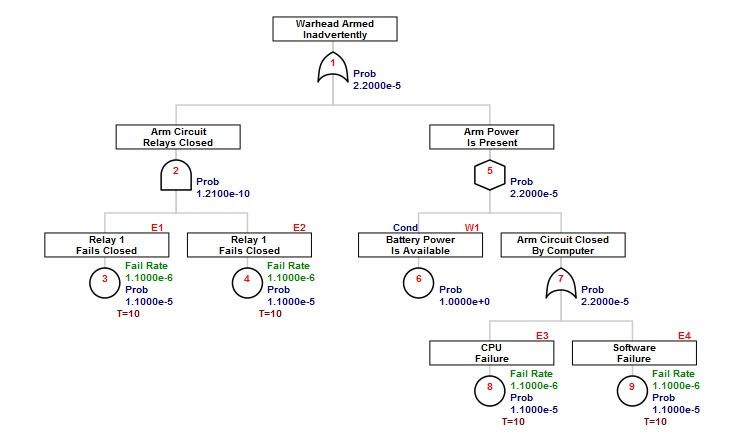

# Non-Repairable System Models {#non-repairable}

```{r, include=FALSE}
knitr::opts_chunk$set(echo = TRUE, eval=TRUE)
library(FaultTree)
```

The genesis of fault tree analysis occurred during evaluation of the Minuteman Launch Control System. The technique progressed through the aerospace industry largely for aircraft, spacecraft and weapons safety studies. All of these models are characterized by a mission through which a system is expected to perform, without opportunity for repair. When quantified, the primary measure of interest is the probability of mission failure within a given duration. This, of course, is the complement of reliability, which is the probability of success over a stated time, under stated conditions.
 
To explore this lesson an example found in Clifton Erickson’s course notes has been selected. This excellent review material can be downloaded at [Fault Tree Analysis, Clifton A. Ericson II](www.thecourse-pm.com/Library/FaultTreeAnalysis2.pdf)


 
The example to be built using the FaultTree package is found on slide 53. A simplified diagram for this example has been modified from a later more complex example in the same text. The undesired event in this case is inadvertent arming of the warhead. Presumably the exposure time starts when the battery is connected to the circuit.

<center>  </center> 

A recommended script is as follows:


```{r}
arm1<-ftree.make(type="or", name="Warhead Armed", name2="Inadvertently")
arm1<-addLogic(arm1, at= 1 , type="and", name="Arm Circuit", name2="Relays Closed")
arm1<-addExposed(arm1, at= 2, mttf=1/1.1e-6, exposure=10, tag="E1", name="Relay 1", name2="Fails Closed")
arm1<-addExposed(arm1, at= 2, mttf=1/1.1e-6, exposure=10, tag="E2", name="Relay 1", name2="Fails Closed")
arm1<-addLogic(arm1, at= 1, type="inhibit", name="Arm Power", name2="Is Present")
arm1<-addProbability(arm1, at= 5, prob=1, tag="W1", name="Battery Power", name2="Is Available")
arm1<-addLogic(arm1, at= 5, type="or", name="Arm Circuit Closed", name2="By Computer")
arm1<-addExposed(arm1, at= 7, mttf=1/1.1e-6, exposure=10, tag="E3", name="CPU", name2="Failure")
arm1<-addExposed(arm1, at= 7, mttf=1/1.1e-6, exposure=10, tag="E4", name="Software", name2="Failure")
```

As before this is calculated with:

```{r}
arm1<-ftree.calc(arm1)
```


```{block, type='rmdimportant'}
Notice that if you forget to make the assignment “arm1<-" the ftree.calc function proceeds and a calculated dataframe is returned for display. But that dataframe will not be persistent unless it is assigned to a variable label. Since the original uncalculated arm1 is no longer of interest after calculation, the new calculated dataframe is stored using the original object name.
```


And viewed with:
```{r}
ftree2html(arm1, write_file=TRUE)
browseURL("arm1.html")
```



There are a number of issues to point out here. First, the data for the basic component events is added to the tree using an addExposed function. The two pieces of quantification data are entered as mttf (consistent with other FaultTree addXxx functions) and exposure [time]. The Greek letter lambda is characteristically used to represent failure rate. The reciprocal of failure rate is the mean time to failure. Entries to function arguments in R can be an expression that returns the desired result. For clarity in what is being done mttf is entered as the reciprocal of the listed lambda. All entered units must be on the same basis. That is, the mean time to failure for all components in this example is on the order of 1 million hours (~100 years) and the exposure time for this mission is 10 hours.
 
ID values are central to identification of all nodes when using FaultTree. A tag attribute provides a means of naming the component event entries and condition entries at the leaves of the tree. Tags may be more human identifiable combinations of letters and numbers that characterize the elements, and they are displayed above and to the right of the label box.
 
While basic components have a resultant probability value ( the probability of failure), in this example “Battery Power is Available” represents a condition. Conditions are also quantified by a probability value. Obviously this condition probability does not represent failure; a clear distinction between the basic component events and this condition. Clifton Erickson’s course tutorial has placed this particular condition in a “house” graphic node. This is identifies a “condition present” and the condition value should be limited to 1. The house graphic has not been implemented in the FaultTree package as a matter of preference . Here a distinction for the condition entry is provided by using an INHIBIT gate. Note that the quantification is the same, whether an AND gate is used or the INHIBIT. For the non-repairable system model the use of INHIBIT for condition entries is purely a means of graphical distinction. The first entry to an INHIBIT gate will be taken as the condition by default, so ordering of the addXxx function lines in the FaultTree script can be significant.
 
Since R allows assignment of function arguments using expressions that return a desired object, the example script can be rewritten to permit easy changing of all the mission exposure time values at once.

```{r}

warhead_exposure<-10
 
arm2<-ftree.make(type="or", name="Warhead Armed", name2="Inadvertently")
arm2<-addLogic(arm2, at= 1, type="and", name="Arm Circuit", name2="Relays Closed")
arm2<-addExposed(arm2, at= 2, mttf=1/1.1e-6, exposure=warhead_exposure, tag="E1", name="Relay 1", name2="Fails Closed")
arm2<-addExposed(arm2, at= 2, mttf=1/1.1e-6, exposure=warhead_exposure, tag="E2", name="Relay 2", name2="Fails Closed")
arm2<-addLogic(arm2, at= 1, type="inhibit", name="Arm Power", name2="Is Present")
arm2<-addProbability(arm2, at= 5, prob=1, tag="W1", name="Battery Power", name2="Is Available")
arm2<-addLogic(arm2, at= 5, type="or", name="Arm Circuit Closed", name2="By Computer")
arm2<-addExposed(arm2, at= 7, mttf=1/1.1e-6, exposure=warhead_exposure, tag="E3", name="CPU", name2="Failure")
arm2<-addExposed(arm2, at= 7, mttf=1/1.1e-6, exposure=warhead_exposure, tag="E4", name="Software", name2="Failure")
```

The script above produces a tree that is no different than arm1. However, now warhead_exposure values can be changed to permit a study of the effect of mission time on the probability of the undesired event. Since we are running in the R environment the tree construction and calculation are performed programmatically. It is possible to program a loop collecting the outcome of interest from multiple tree calculations in a separate dataframe, like so:

```{r}
TimeStudy<-data.frame(Exposure_Time=NULL, Prob_of_Failure=NULL)
for(power in 0:7) {
warhead_exposure<-10^power
arm2<-ftree.make(type="or", name="Warhead Armed", name2="Inadvertently")
arm2<-addLogic(arm2, at= 1, type="and", name="Arm Circuit", name2="Relays Closed")
arm2<-addExposed(arm2, at= 2, mttf=1/1.1e-6, exposure=warhead_exposure, tag="E1", name="Relay 1", name2="Fails Closed")
arm2<-addExposed(arm2, at= 2, mttf=1/1.1e-6, exposure=warhead_exposure, tag="E2", name="Relay 2", name2="Fails Closed")
arm2<-addLogic(arm2, at= 1, type="inhibit", name="Arm Power", name2="Is Present")
arm2<-addProbability(arm2, at= 5, prob=1, tag="W1", name="Battery Power", name2="Is Available")
arm2<-addLogic(arm2, at= 5, type="or", name="Arm Circuit Closed", name2="By Computer")
arm2<-addExposed(arm2, at= 7, mttf=1/1.1e-6, exposure=warhead_exposure, tag="E3", name="CPU", name2="Failure")
arm2<-addExposed(arm2, at= 7, mttf=1/1.1e-6, exposure=warhead_exposure, tag="E4", name="Software", name2="Failure")
arm2<-ftree.calc(arm2)
study_row<-data.frame(Exposure_Time=warhead_exposure, Prob_of_Failure=arm2$PBF[1])
TimeStudy<-rbind(TimeStudy, study_row)
}
```

```{r}
TimeStudy
```


By changing the range “0:7” for the power value in the for loop to “seq(0,7, by=.1)” a plot can be generated with a fairly smoothed line curve.

```{r}
plot(TimeStudy, log="x", type="l")
```


