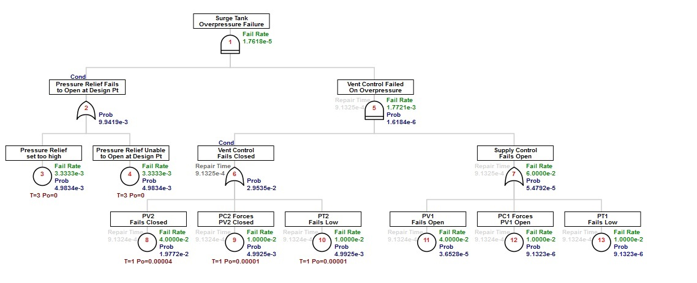

 # Conditional Sequence 

```{r setup_basics, include=FALSE}
knitr::opts_chunk$set(echo = TRUE, eval=TRUE)
library(FaultTree)
```

Thus far examples have demonstrated the use of OR, AND and INHIBIT gates. In the non-repairable model there is no difference between the AND and INHIBIT calculations. Both combine feeding probabilities by multiplication. The only difference is that the INHIBIT clarifies which feed is considered a condition. Now with the repairable model it can be observed that the INHIBIT essentially strips the conditional feed of all information but its probability parameter representing percent of time. As such the INHIBIT can model a sequential nature for certain conditions, typically protective, followed by a catastrophic hazard event. Yet, in some combinations the possible reversibility of the condition is an important consideration. The PRIORITY gate (referenced often as Priority AND) provides a conditional sequence logic appropriately handling a wider variety of combinations than the INHIBIT.
 
Consider the independent failure of active pumps similar to those modeled as the Repairable System Model was introduced.
 
```{r}
actAND<-ftree.make(type="and", name="Independent Failure", name2="of Active Pumps")
actAND<-addActive(actAND, at=1, mttf=3, mttr=12/8760, name="Pump 1")
actAND<-addActive(actAND, at=1, mttf=3, mttr=12/8760, name="Pump 2")
actAND<-ftree.calc(actAND)
actAND[1,6:8]
```

The selected range output reveals the quantification of just the top event. Then a line is added to display the repair time for the conditional event with a conversion from years to hours.

```{r}
actAND
```

From this simple model it is observed that the repair time for dual pump failure is half the mttr input for single pump recovery. This is the mean of a saw-toothed distribution generated by a convolution of the pump downtime events. A second pump fails randomly within the 12 hour repair time of an initial pump failure. The event ends when the first pump to fail is repaired. It can be thought of that statistically the second pump fails mid-way into the failure of the first.
 
Now a tree if formed by placing the same pumps under an INHIBIT gate.
```{r}
actPRIORITY<-ftree.make(type="priority", reversible_cond=TRUE, name="Conditional Sequence", name2="of Repairable Pumps")
actPRIORITY<-addActive(actPRIORITY, at=1, mttf=3, mttr=12/8760, name="Pump 1")
actPRIORITY<-addActive(actPRIORITY, at=1, mttf=3, mttr=12/8760, name="Pump 2")
actPRIORITY<-ftree.calc(actPRIORITY)
```

```{r}
actPRIORITY [1,6:8]
```

A physical analogy to this calculation would be a primary Pump 1 with a secondary stand-by backup Pump 2. Dual pump failure only occurs when the backup pump fails within the repair window of the primary. However, the event ends upon repair of the primary pump. Presumably then Pump 2 is returned to stand-by service once repaired. The distinction in the gate is made possible due to information on the repair time for the event presented as a condition. Again there is a convolution of the pump downtime events. However, dual pump failure requires a specific sequence beginning with failure of the primary pump.
 
Systems with latency are more likely to generate conditions for propagation of unwanted events since the hidden nature of latent faults awaits compounding with some hazard event. When a condition is not effectively reversible once encountering a critical hazard the PRIORITY calculation is similar to the INHIBIT .
 
Consider a fictitious pressurized system with pressure controlled feed and pressure controlled venting as the only protection against overpressure.


The following table summarizes the input parameters:


> For the next FaultTree model scripts the magrittr (mag-rit-tay) package will be used. Since this is an established package on the CRAN repository installation is rather straight forward. I would usually close any open R consoles in order to avoid any confusion. Then open one, as administrator, to execute menu selections Packages -> Install package(s). . . select the first mirror, then scroll down to magrittr. As with any package to use it in a session the library must be loaded. So, commands for library(magrittr) as well as library(FaultTree) will be required in any new R session.
The magrittr package provides a short hand notation for passing the developing FaultTree object to successive script lines. The example code demonstrates this use. Note the definition of a new %>% operator permits successive representation of the object as a dot for the first argument in the function call following the %>% operator.

A simple fault tree is now generated for Surge Tank Overpressure Failure.
```{r}
library(FaultTree)
library(magrittr)
 
surgePRIORITY<-ftree.make(type="priority", name="Surge Tank", name2="Overpressure Failure")
surgePRIORITY<-surgePRIORITY %>%
addLogic(., at=1, type="or", name="Vent Control", name2="Fails Closed") %>%
addLogic(., at=1, type="or", name="Supply Control", name2="Fails Open") %>%
addLatent(., at=2, mttf=25, mttr=8/8760, pzero="repair", inspect=1, name="PV2", name2="Fails Closed") %>%
addLatent(., at=2, mttf=100, mttr=8/8760, pzero="repair", inspect=1,
name="PC2 Forces", name2="PV2 Closed") %>%
addLatent(., at=2, mttf=100, mttr=8/8760, pzero="repair", inspect=1,
name="PT2", name2="Fails Low") %>%
addActive(., at=3, mttf=25, mttr=8/8760, name="PV1", name2="Fails Open") %>%
addActive (., at=3, mttf=100, mttr=8/8760, name="PC1 Forces", name2="PV1 Open") %>%
addActive (., at=3, mttf=100, mttr=8/8760, name="PT1", name2="Fails Low") %>%
ftree.calc(.)
 
ftree2html(surgePRIORITY, write_file=TRUE)
browseURL("surgePRIORITY.html")
```


> This script has rendered poorly in the code block, but it should copy and paste successfully. It is now expected that either text files as discussed in Fault Tree Basics or spreadsheet as discussed in the (pending) Appendix are being used by the reader to hold these developing scripts.

Now the same tree can be re-created using an inhibit gate for the top event. Only the first two lines of the script ( after the library calls) need to be changed since the magrittr pipeline is used. The browseURL function cannot utilize the pipeline, so a graphical view has to be generated separately.
 
The four lines of code to include in the new script are:
```{r, eval=FALSE}
surgeINHIBIT<-ftree.make(type="inhibit", name="Surge Tank", name2="Overpressure Failure") 
# surgeINHIBIT<-surgeINHIBIT %>%
 
ftree2html(surgeINHIBIT, write_file=TRUE)
browseURL("surgeINHIBIT.html")
```

Since the point of interest here is the difference between the two top gates a photoshoped image of these two collapsed trees is presented in one frame.

Both top gates receive the same information from the feeding OR gates. The condition only passes a probability value. In the case of the PRIORITY gate this is because the default of reversible_cond = FALSE has been set. If the result of vent failure leads to vessel rupture, it makes no sense to pass on vent system repair information. Further, this irreversible PRIORITY gate has resolved its resulting event to be a pure demand with an output containing a fail rate result only.
 
The INHIBIT gate simply applies the conditional percent of time on both Fail Rate and Probability of the combining event. All inhibited information from the combined event is passed upward even if it is irrelevant for the model under consideration. However, there is no difference in the final Fail Rate calculated output.
 
To make this example more realistic, and ASME code compliant, a pressure relief valve is added to the surge tank. This adds a valuable redundancy to over-pressure relief venting as expected. It also renders the failure condition of the vent controller to be reversible.
```{r}
surge3<-ftree.make(type="priority", name="Surge Tank", name2="Overpressure Failure")
surge3<-surge3 %>%
addLogic(., at=1, type="or",
name="Pressure Relief Fails", name2="to Open at Design Pt") %>%
addLatent (., at=2, mttf=300, pzero=0, inspect=3,
name="Pressure Relief", name2="set too high") %>%
addLatent(., at=2, mttf=300, pzero=0, inspect=3,
name="Pressure Relief Unable", name2="to Open at Design Pt") %>%
addLogic(., at=1, type="priority", reversible_cond=TRUE,
name="Vent Control Failed", name2="On Overpressure") %>%
addLogic(., at=5, type="or", name="Vent Control", name2="Fails Closed") %>%
addLogic(., at=5, type="or", name="Supply Control", name2="Fails Open") %>%
addLatent(., at=6, mttf=25, mttr=8/8760, pzero="repair", inspect=1, name="PV2", name2="Fails Closed") %>%
addLatent(., at=6, mttf=100, mttr=8/8760, pzero="repair", inspect=1,
name="PC2 Forces", name2="PV2 Closed") %>%
addLatent(., at=6, mttf=100, mttr=8/8760, pzero="repair", inspect=1,
name="PT2", name2="Fails Low") %>%
addActive(., at=7, mttf=25, mttr=8/8760, name="PV1", name2="Fails Open") %>%
addActive (., at=7, mttf=100, mttr=8/8760, name="PC1 Forces", name2="PV1 Open") %>%
addActive (., at=7, mttf=100, mttr=8/8760, name="PT1", name2="Fails Low") %>%
ftree.calc(.)
 
ftree2html(surge3, write_file=TRUE)
browseURL("surge3.html")
```

Although the reversibility of the vent controller failed state does not affect the quantification in this example, the repair information from this condition is now passed upward from gate 6. The graphic displays the repair rate information for the condition in darker font to provide a verification that the condition has been considered reversible. The fact that a failed condition for pressure relief valve is not reversible has precluded further use of the vent controller reversibility information in the top event of this example.